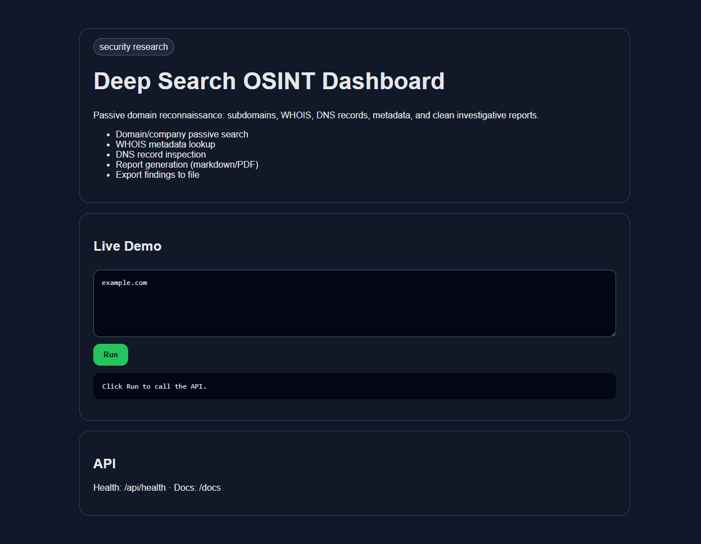

# Deep Search OSINT Dashboard

    

Passive domain reconnaissance: subdomains, WHOIS, DNS records, metadata, and clean investigative reports.



## Features
- Domain/company passive search
- WHOIS metadata lookup
- DNS record inspection
- Report generation (markdown/PDF)
- Export findings to file

## Quick Start

```bash
uv sync
uv run uvicorn src.main:app --reload --port 8108
```

Open: http://localhost:8108

## API
- `GET /` - browser demo
- `GET /api/health` - health check
- `GET /docs` - interactive FastAPI docs

## Verify
```bash
uv run pytest -q
```
